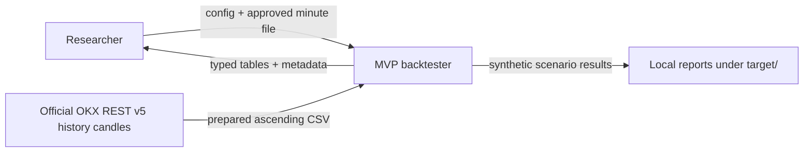
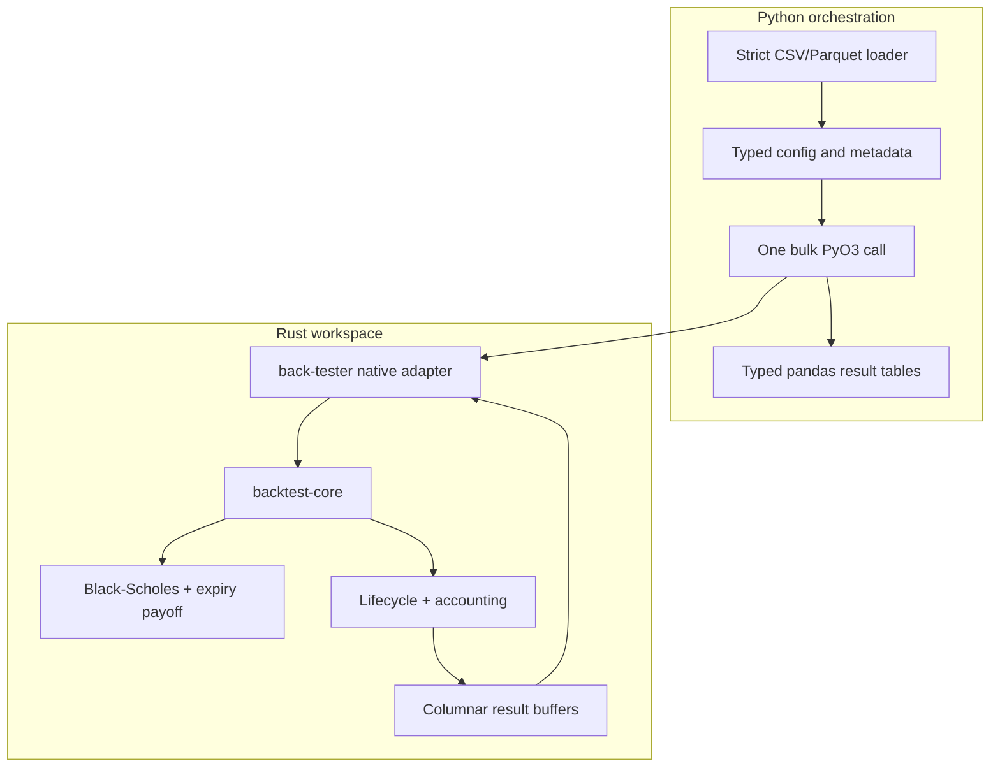
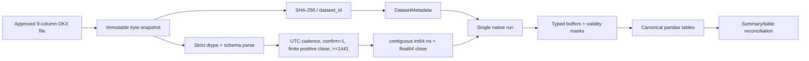
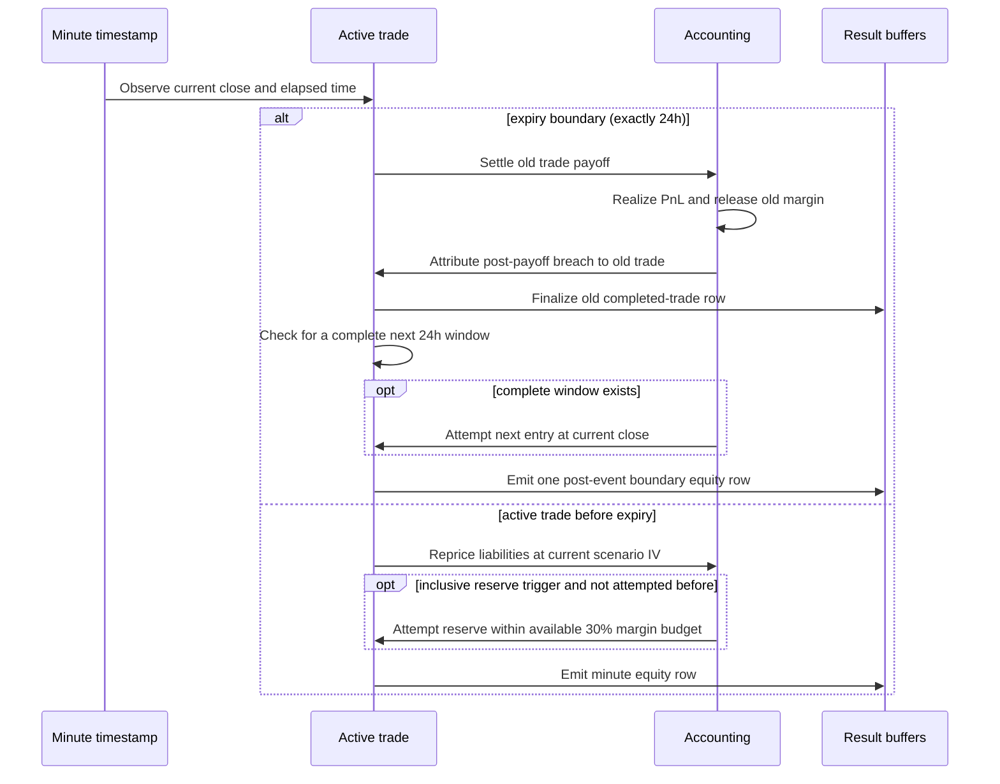
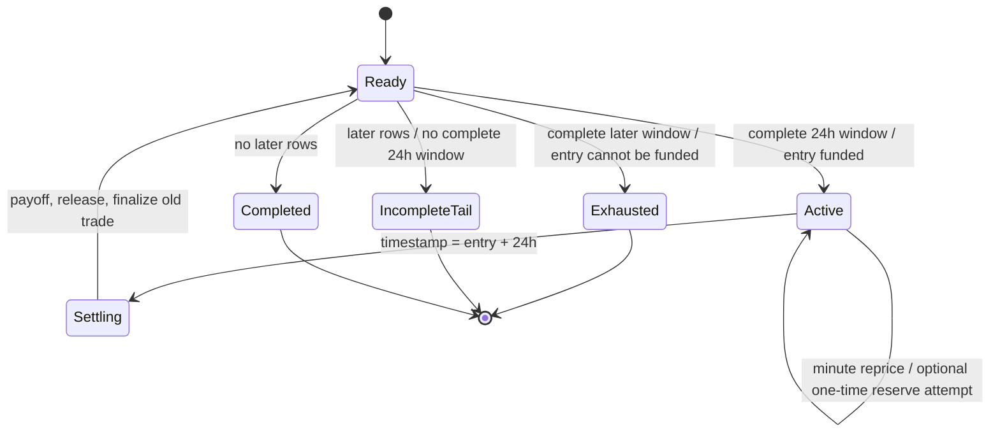

# MVP architecture overview

This compact pack helps readers navigate the system. Normative behavior is
defined by the [canonical architecture](01_btc_24h_rust_python_mvp.md), the
[minute-data contract](../data/okx_btcusdt_swap_1m.md), and the
[epic briefs](../epics/README.md).

## System context

The only approved market input is the BTC-USDT-SWAP perpetual minute close.
Options, IV shocks, and margin are synthetic model inputs, not replayed exchange
observations.

## Containers and components

Rust is the single source of truth for pricing, validation, lifecycle,
accounting, and results. Python validates bulk I/O and renders the returned
buffers; it does not reproduce the financial state machine.

## Data and run flow

Hashing and parsing use the same snapshot. Runtime code never sorts, fills, or
repairs input. Exact fields and rejection rules live in the
[data contract](../data/okx_btcusdt_swap_1m.md).

## Exact 24-hour lifecycle

## Trade lifecycle state machine

`Ready` means there is no active trade. Before every entry the engine first
checks that the input contains a complete 24-hour window. `Active` covers minute
repricing and the optional one-time reserve attempt. `Settling` is the exact
expiry event: payoff is realized, margin is released, and the completed-trade
row is finalized. The return to `Ready` between settlement and a possible
same-timestamp entry is a transient internal state; the engine emits only one
post-event equity row for that timestamp.

`Exhausted` maps to a valid result with
`terminal_status=capital_exhausted` when a later complete window exists but its
entry cannot be funded. Insufficient capital for the very first entry is instead
a typed `InsufficientInitialCapital` error with no result. `IncompleteTail` is a
terminal reason, not an active-trade state: strictly later rows that cannot form
a complete window are excluded while `Ready`, the result keeps
`terminal_status=completed`, and `skipped_incomplete_window_count=1` records the
reason. With no later rows, `Completed` has the same terminal status and no
skipped tail.

At a shared daily boundary the immutable event order is settlement and margin
release, complete-window check, optional next entry, then exactly one post-event
row. Full details, including reserve sizing, drawdown, and table schemas, remain in the
[canonical architecture](01_btc_24h_rust_python_mvp.md).
